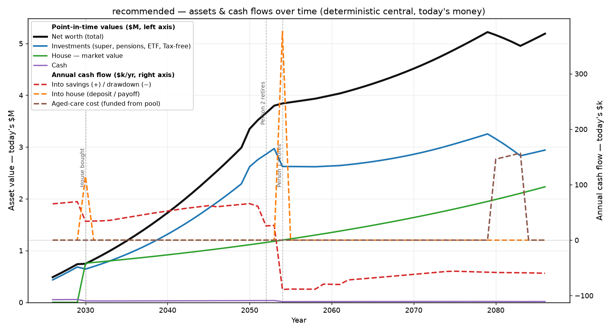

# AI First Financial Planning Tool

A config-driven **lifetime cash-flow model** for a household — designed to be set up and
driven conversationally with [Claude Code](https://claude.com/claude-code). You describe
your goals and finances in plain English; Claude fills in the config and runs the model;
you get deterministic **and** Monte Carlo projections of whether your money lasts.

It answers two questions:

1. **Can we retire when we want**, with the lifestyle we want?
2. **Does our capital last** — do investments + pensions + super cover our target spend
   without prematurely running the pot dry?

Under the hood it's a recognised industry-standard method (a cash-flow forward simulator,
the approach used by Voyant / eMoney / RightCapital and expected by FCA FG22/5) with full
Australian-resident tax, per-bucket drawdown under super-access rules, a spending
glidepath, stress overlays, and an actuarial funded ratio.

> ⚠️ **Not financial advice.** This is a decision-support model for education and
> exploration. Outputs are projections from assumptions *you* control, not predictions or
> recommendations. Tax/structure defaults are illustrative (Australian by default).
> Confirm anything material with a licensed adviser. See [LICENSE](LICENSE).

---

## Getting started

This is built to be **driven by [Claude Code](https://claude.com/claude-code)** — you talk,
it does the work. You don't need to run commands or edit YAML by hand.

1. Get the project: clone (or fork) this repo and open the folder in Claude Code
   (or run `claude` inside it).
2. Say:

   > **"Let's start"**   *(or "help me set up my plan")*

That's it. Claude then:

- **sets up the Python environment** (creates the venv, installs dependencies);
- **runs the fictional demo** so you can see what the model produces before entering anything;
- **asks you about your goals and finances** — when you want to retire, target spend, home
  vs. rent, balances — and writes your answers into your own **private, git-ignored** config;
- **runs your plan and explains the results** (can your income sustain it, funded ratio,
  terminal wealth) and helps you explore "what if" scenarios.

The full flow Claude follows is in [CLAUDE.md](CLAUDE.md) — you don't need to read it.

**Prerequisites:** Python 3.10+ and Claude Code. That's all.

### What you get

Each run writes a markdown summary, an Excel workbook, and (with `--chart`) a PNG of the
assets and cash flows over your lifetime. Here's the chart for the bundled fictional example:



The console summary for the same run looks like this:

```
scenario                sustains  preserved  funded   P50 terminal
recommended                 83%       60%    1.42         5.75M

Stress overlays (deterministic central, terminal today's money):
  base                5.19M  ok
  year1_crash         2.80M  ok
  sustained_low       2.07M  DEPLETED
  high_inflation      1.44M  DEPLETED
  ...
```

…and the full markdown report is here: **[docs/assets/example-summary.md](docs/assets/example-summary.md)**.
See [Outputs](#outputs) below for what each artifact contains.
*(All figures are from the fictional example, for illustration only.)*

### Prefer the command line?

Everything Claude does, you can do yourself:

```bash
cd model
python3 -m venv .venv && .venv/bin/pip install -r requirements.txt

# See the fictional demo immediately (no setup needed):
.venv/bin/python run.py --config config.example.yaml --scenario recommended

# Set up your own plan: copy the template into the git-ignored personal/ folder,
# fill in the fields marked `# FILL`, then run it:
cp config/config.skeleton.yaml config/personal/config.yaml
.venv/bin/python run.py --scenario recommended
```

---

## Using it

| You want to… | Do this |
|---|---|
| Run the recommended plan | `run.py --scenario recommended` |
| Run every scenario at once | `run.py --scenario all` |
| Run one named scenario | `run.py --scenario rent_forever` |
| Add a chart (PNG) | add `--chart` |
| More Monte Carlo precision | add `--trials 5000` |
| Try the demo without setup | add `--config config.example.yaml` |

**Creating a new scenario.** Scenarios are *sparse overrides* of your base config — change
only what differs. Add a block to [`model/config/scenarios.yaml`](model/config/scenarios.yaml)
and it becomes available to `--scenario`. For example, "what if we retire a year earlier":

```yaml
  retire_early:
    events: { person1_retires: { year: 2052 } }
```

The shipped file has worked examples (cheaper house, no inheritance, rent forever, save
more, max super, …) to copy from.

**Reading the headline numbers:** *sustains* = % of Monte Carlo paths where spending is met
every year without depleting the pool; *preserved* = % where terminal capital stays near its
start; *funded ratio* = PV(assets + income) / PV(spending), where ≥ 1.0 means fully funded.

---

## Outputs

Every run writes to **`model/outputs/`** (git-ignored — these are generated, so regenerate
them rather than hand-editing). A single-scenario run lands at the top level; `--scenario all`
fans the per-scenario files into `model/outputs/scenarios/`. Each run produces:

| Artifact | What it is | Example |
|---|---|---|
| **`<scenario>-summary.md`** | A readable per-scenario report — headline P(sustains)/preserved/funded ratio, the net-worth trajectory, the retirement-spend glidepath, full Monte Carlo percentiles, and the documented assumptions. | [example-summary.md](docs/assets/example-summary.md) |
| **`<scenario>-chart.png`** | *(with `--chart`)* Assets (net worth, investments, house, cash) on the left axis and annual cash flows on the right, across your whole lifetime. | [example-chart.png](docs/assets/example-chart.png) |
| **`scenarios.xlsx`** | An Excel workbook: a **Summary** grid comparing every scenario, a **MonteCarlo** sheet, and a per-scenario **annual ledger** (assets → liabilities → net assets → inflows/outflows → net cash-flow → net worth, years as columns, in today's money). | — |

Also printed to the console: the one-line headline per scenario and an FCA-style **stress
table** (year-1 crash, sustained-low returns, high inflation, longevity tail, house
corrections, aged-care-from-pool) flagging which overlays deplete the pool.

The two files under [`docs/assets/`](docs/assets/) are committed snapshots of the fictional
example so you can preview the output here; your own runs never touch them.

---

## What's in here

```
README.md                  this file
CLAUDE.md                  project guide + the Claude onboarding flow (entry point for Claude)
LICENSE                    MIT + not-financial-advice disclaimer
model/                     the engine
  README.md                method, structure, and the full CLI reference
  run.py                   the CLI
  config/
    config.skeleton.yaml   the all-null template — copy into personal/ and fill in
    config.example.yaml    a complete fictional config you can run immediately
    scenarios.yaml         named "what if" overrides
    personal/              YOUR inputs live here (git-ignored); config.yaml is the default
  finmodel/                the model package (tax, returns, drawdown, Monte Carlo, …)
  tests/                   pytest suite (109 tests; run `.venv/bin/python -m pytest`)
  DECISIONS.md             dated log of why each assumption is what it is
docs/research/             planning-methodology research the model is built on
```

The tax defaults are Australian-resident; replace the `tax` block in your config to model
another country. The model deals in **one currency** (AUD by convention).

## Privacy

Your real data lives in `model/config/personal/`, which is **git-ignored as a whole** —
nothing you put there (your `config.yaml`, plan variants, exported numbers) is ever
committed. The tracked `config.skeleton.yaml` and `config.example.yaml` contain no real
data. If you fork this repo, a quick `git status` should never show anything under
`config/personal/` except its `README.md`.

## License

[MIT](LICENSE), with a not-financial-advice disclaimer. Use at your own risk.
